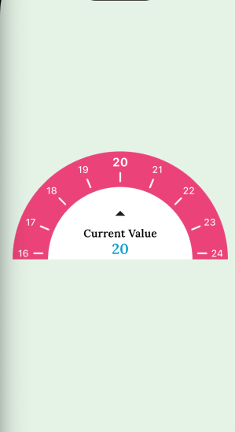

# Dial Slider

A smooth, animated semicircular dial slider for Flutter.  
Perfect for selecting values like weeks, levels, or ranges with an intuitive circular UI.

---

## 📸 Preview



---

## ✨ Features

- 🎯 Semi-circular dial UI with tick marks  
- 👆 Drag and tap to select values  
- ⚡ Smooth animated snapping to nearest tick  
- 🔢 Configurable min & max range  
- 📱 Lightweight and easy to integrate  

---

## 🚀 Getting Started

Add the dependency in your `pubspec.yaml`:

```yaml
dependencies:
  dial_slider: ^0.0.1
```

## Usage

```dart
import 'package:dial_slider/dial_slider.dart';
import 'package:flutter/material.dart';

class MyWidget extends StatefulWidget {
  const MyWidget({super.key});

  @override
  State<MyWidget> createState() => _MyWidgetState();
}

class _MyWidgetState extends State<MyWidget> {
  int value = 12;

  @override
  Widget build(BuildContext context) {
    return DialSlider(
      initialValue: value,
      min: 1,
      max: 40,
      onChanged: (v) => setState(() => value = v),
    );
  }
}
```

## Additional information

- A runnable demo app is included in `example/`.
